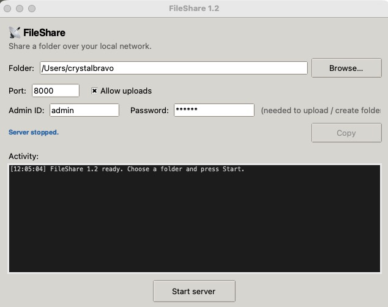
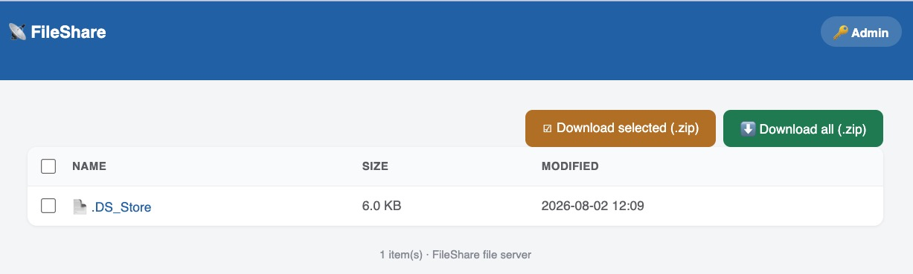
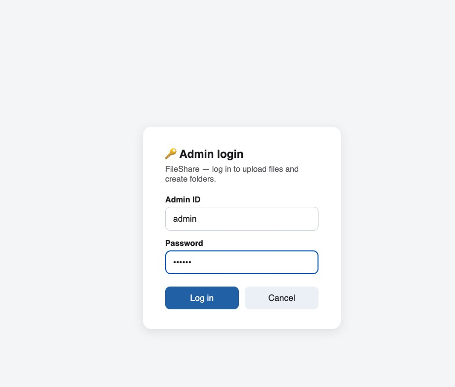
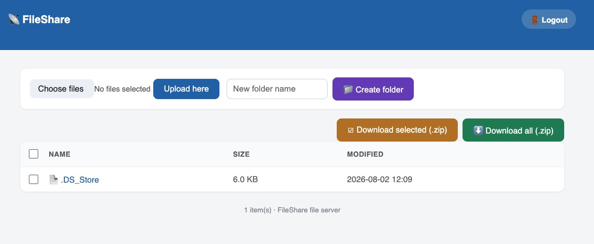

# FileShare

Share any folder over your local network from a small desktop app — like HFS,
but in pure Python (standard library only, no dependencies). Works on
**Windows**, **macOS**, and Linux.



## Quick start

**Windows** — put `run-windows-python.bat` next to `fileshare.py` and
**double-click it**. It finds or auto-installs Python 3, then opens the app.

**macOS** — install Python from https://python.org if needed, then:

```bash
cd ~/Downloads/FileShare
python3 fileshare.py
```

Choose a folder, press **Start server**, and share the URL shown
(e.g. `http://192.168.1.20:8000`). Allow the firewall prompt if one appears.

## The web page

**What visitors see** — everyone on your network can **browse**, **download**
files, and grab **Download all (.zip)** or **Download selected (.zip)** (tick
the checkboxes; the header checkbox selects all):



**Admin login** — uploading and creating folders are admin-only and hidden by
default. Click the **🔑 Admin** link (top-right) to open the login panel
(default `admin` / `passwd`; Cancel returns to the file list):



**After logging in** the *Upload here* and *Create folder* controls appear and
the top-right link becomes **🚪 Logout**, which ends the session and hides
them again. Logins are kept in a session cookie, valid 8 hours. Duplicate
upload names are saved as `name (1).ext`, never overwritten:



Unicode (Chinese/Japanese/Korean) file and folder names work everywhere:
browsing, upload, download, and ZIPs.

## Options

Set the admin ID/password and port in the app window, or via the command line:

```bash
python fileshare.py [folder] [-p PORT] [--no-upload] [--no-gui]
                    [--admin-id ID] [--admin-password PW]
```

`--no-gui` runs headless in a terminal (good for servers); `--no-upload`
makes the share read-only for everyone.

## Safety notes

- Meant for your own LAN — don't expose it to the public internet.
- Reads are open to anyone on the network; writes need the admin login.
  **Change the default `admin`/`passwd`** (the app warns if you don't).
  Logins use a session cookie; the password still travels over plain HTTP at
  login, so keep it to trusted networks.
- The server never serves anything outside the folder you chose.

## Files

| File                               | Purpose                              |
|------------------------------------|--------------------------------------|
| `fileshare.py`                     | The whole app — GUI + web server.    |
| `run-windows-python.bat`           | Windows one-step installer/launcher. |
| `images/fileshare-app-mac.jpg`     | Desktop app screenshot.              |
| `images/fileshare-web-visitor.jpg` | Web page — visitor view.             |
| `images/fileshare-web-login.jpg`   | Web page — admin login panel.        |
| `images/fileshare-web-admin.jpg`   | Web page — admin view with controls. |

*FileShare 1.2 — single file, MIT-style free to use and modify.*
