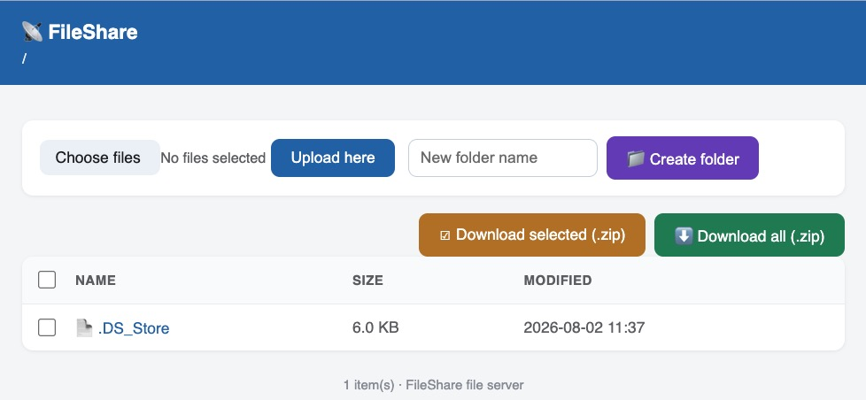

# FileShare

Share any folder over your local network from a small desktop app — like HFS,
but in pure Python (standard library only, no dependencies). Works on
**Windows**, **macOS**, and Linux.


## Quick start

**Windows** — put `run-windows-python.bat` next to `fileshare.py` and
**double-click it**. It finds or auto-installs Python 3, then opens the app.

**macOS** — install Python from https://python.org if needed, then:

```bash
cd ~/Downloads/FileShare
python3 fileshare.py
```

Choose a folder, press **Start server**, and share the URL shown
(e.g. `http://192.168.1.20:8000`). Allow the firewall prompt if one appears.

## The web page



Everyone on your network can **browse**, **download** files, and grab
**Download all (.zip)** or **Download selected (.zip)** (tick the checkboxes;
the header checkbox selects all).

**Uploading and creating folders are admin-only and hidden by default.**
Click the **🔑 Admin** link (top-right), log in — default `admin` / `passwd` —
and the *Upload here* and *Create folder* controls appear for the rest of the
session. Cancelling the login just returns to the file list. Duplicate upload
names are saved as `name (1).ext`, never overwritten.

Unicode (Chinese/Japanese/Korean) file and folder names work everywhere:
browsing, upload, download, and ZIPs.

## Options

Set the admin ID/password and port in the app window, or via the command line:

```bash
python fileshare.py [folder] [-p PORT] [--no-upload] [--no-gui]
                    [--admin-id ID] [--admin-password PW]
```

`--no-gui` runs headless in a terminal (good for servers); `--no-upload`
makes the share read-only for everyone.

## Safety notes

- Meant for your own LAN — don't expose it to the public internet.
- Reads are open to anyone on the network; writes need the admin login.
  **Change the default `admin`/`passwd`** (the app warns if you don't).
  Credentials use HTTP Basic auth (unencrypted) — fine for trusted networks.
- The server never serves anything outside the folder you chose.

## Files

| File                     | Purpose                                  |
|--------------------------|------------------------------------------|
| `fileshare.py`           | The whole app — GUI + web server.        |
| `run-windows-python.bat` | Windows one-step installer/launcher.     |
| `fileshare-app-mac.jpg`  | Desktop app screenshot.                  |
| `fileshare-web-ui.jpg`   | Web page screenshot (admin view).        |

*FileShare 1.2 — single file, MIT-style free to use and modify.*
